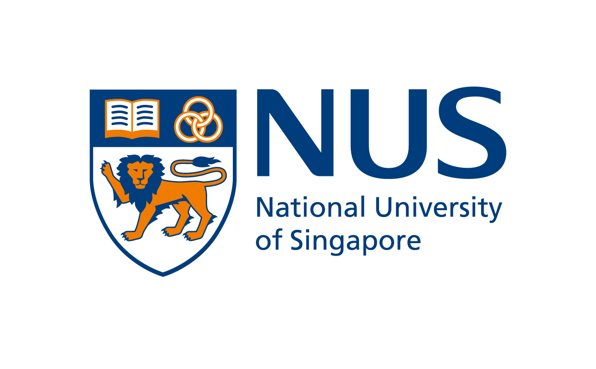

::: {.hero-wrap}
::: {.hero-grid}

::: {.hero-copy}
# LightSPAN

::: {.hero-subtitle}
Optimising light exposure across the lifespan
:::

::: {.hero-description}
LightSPAN is a multidisciplinary research project in Singapore exploring how healthier daily light exposure can support vision, sleep, cognitive well-being and healthy ageing.
:::

::: {.hero-buttons}
[About the project](about.qmd){.hero-button .hero-button-primary}
[Publications](publications.qmd){.hero-button .hero-button-secondary}
:::
:::

::: {.hero-visual}
{.hero-image}
:::

:::
:::

::: {.section-block}
## Why light matters

Receiving the right light at the right time is important for human health and wellbeing. LightSPAN investigates how optimising daily light exposure may improve health outcomes across the life course.
:::

::: {.section-block}
## Focus populations

::: {.card-grid}
::: {.info-card}
### School-aged children

Supporting healthy visual development and helping prevent or delay myopia through healthier daylight habits.
:::

::: {.info-card}
### Older adults

Promoting healthy ageing through better light exposure practices that support sleep, mood, cognitive and physical function.
:::
:::
:::

::: {.section-block}
## The LightUP app

LightSPAN includes **LightUP**, a mobile health app designed to provide personalised light exposure recommendations, track real-time light exposure and support sustainable behaviour change.

[Learn more about the project](about.qmd)
:::

::: {.section-block}
## Institutions

::: {.institution-grid}

::: {.institution-item}
{.institution-logo}

TUMCREATE

:::

::: {.institution-item}
{.institution-logo}

National University of Singapore

:::

::: {.institution-item}
{.institution-logo}

Lions Befrienders Singapore

:::

::: {.institution-item}
{.institution-logo}

National Research Foundation, Singapore

:::

:::
:::